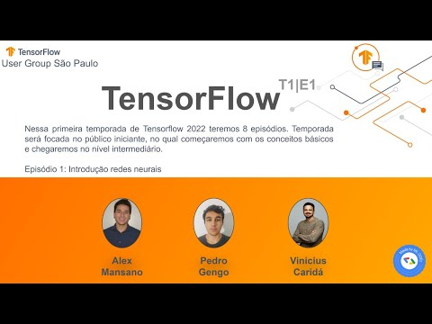
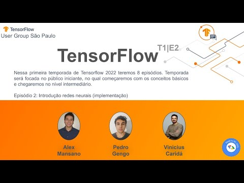
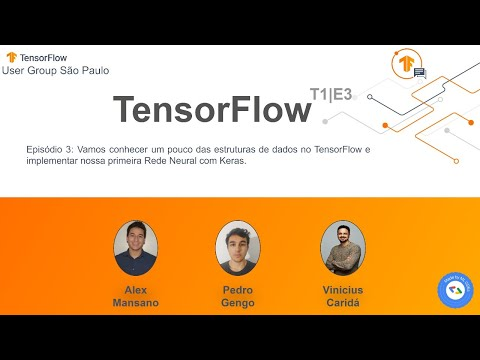
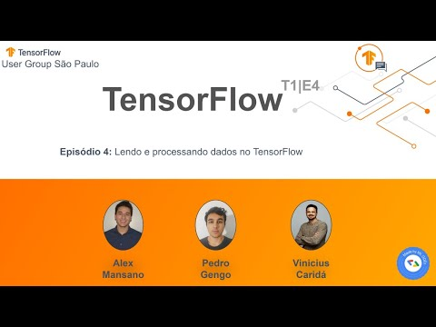

# Tensorflow iniciantes 2022
Repositório destinado ao compartilhamento dos materias e vídeos referentes ao curso de tensorflow para iniciantes ministrado em 2022.

- **Episódio 1:** Introdução a redes neurais

  
  
- **Episódio 2:** Introdução a redes neurais - prática

  

- **Episódio 3:** Estruturas de dados no Tensorflow e Keras

  

- **Episódio 4:** Processamento de dados no Tensorflow

  
